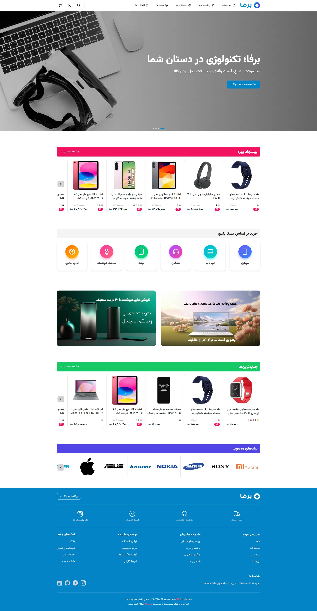
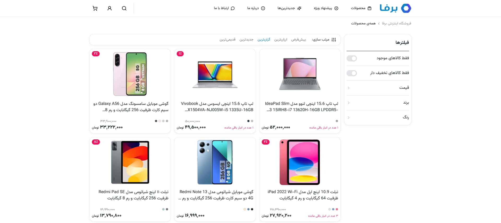
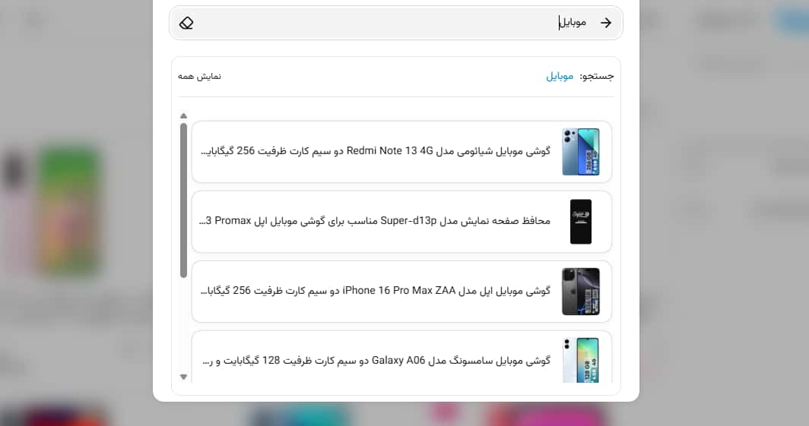
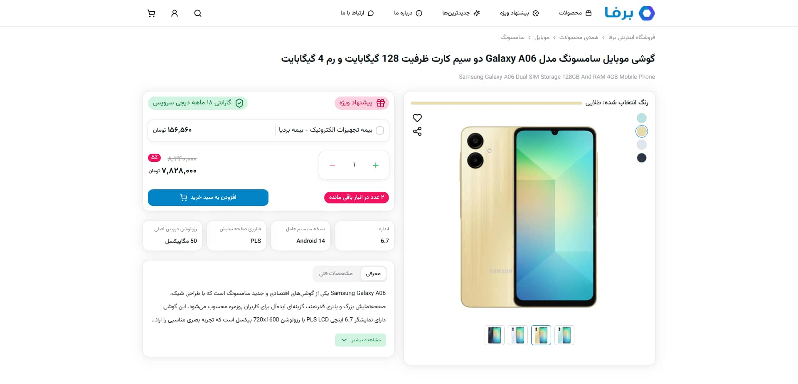
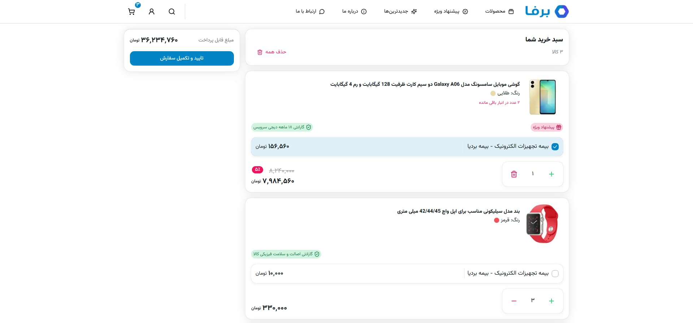
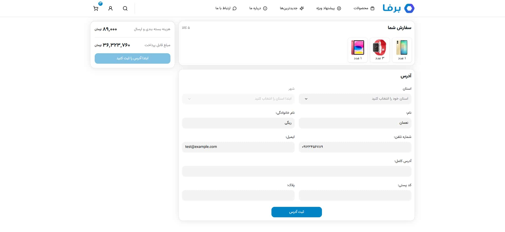
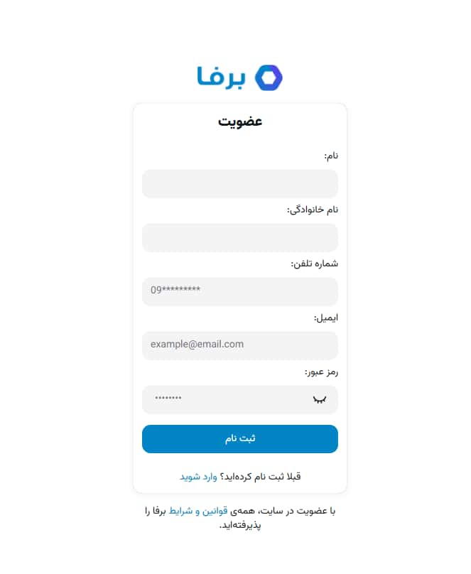
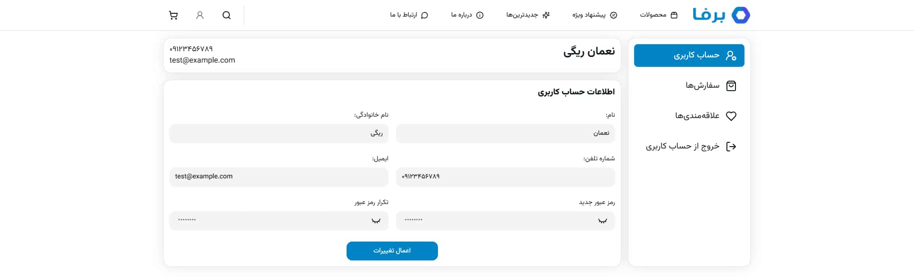
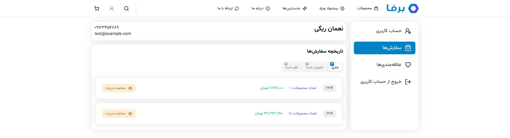
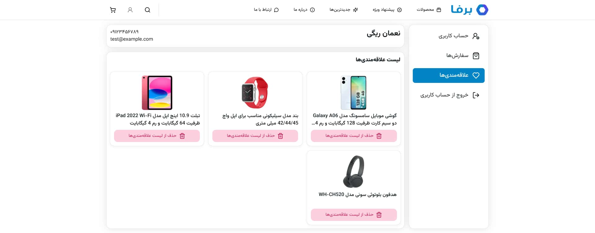

#  Barfa


**Barfa** is a modern **tech shop** built with **Next.js**, **TypeScript**, **Tailwind CSS**, and **Heroui** for UI components. Users can browse products, search, add to cart, checkout, and manage their accounts with nested pages like orders and favorites.

▶ **Live Demo:** [Barfa](https://barfa.vercel.app)

📱 Fully responsive for mobile, tablet, and desktop.



---

## ✨ Features

### 🏠 Homepage

- Hero slider with Swiper
- Featured products
- Quick links to categories

### 🗂 Category Page

- Filter & sort products

### 📦 Product Page

- Product details and introduction
- Add to cart functionality

### 🛒 Cart & Checkout

- Review items, update quantities
- Proceed to checkout
- Order summary

### 👤 Account

- Orders page
- Favorites page
- Profile settings (update username, password, ...)

### 🔍 Search

- Keyword-based product search

### 🔐 Authentication

- Signup and login

---

## 🛠 Tech Stack

### Frontend

| Technology        | Usage                    | Version |
| ----------------- | ------------------------ | ------- |
| **Next.js**       | Framework                | 15.4.3  |
| **React**         | Core UI                  | 19.1.0  |
| **TypeScript**    | Type safety              | 5.0     |
| **Tailwind CSS**  | Styling & responsiveness | 4.0     |
| **Zustand**       | State management         | 5.0.8   |
| **Swiper**        | Slider/Carousel          | 11.2.10 |
| **Lucide React**  | Icons                    | 0.525.0 |
| **Framer Motion** | Animations               | 12.23.9 |
| **@heroui/react** | UI components            | 2.8.1   |

### Backend

| Technology             | Usage                       | Version  |
| ---------------------- | --------------------------- | -------- |
| **Supabase Database**  | PostgreSQL-powered database | 2.53     |
| **Row Level Security** | Fine-grained access control | Built-in |
| **Supabase Storage**   | Upload & manage files       | Built-in |

---

## 📸 Screenshots

| Page                  | Preview                                                |
| --------------------- | ------------------------------------------------------ |
| **Category**          |            |
| **Search**            |                |
| **Product**           |              |
| **Cart**              |                    |
| **Checkout**          |            |
| **Signup**            |                |
| **Login**             |                  |
| **Account**           |              |
| **Orders**            |                |
| **Favorite Products** |  |

---

## 🚀 Getting Started

### Prerequisites

- Node.js ≥18.x
- Supabase account (optional if you want full backend functionality)

### Installation

1. Clone the repository:

   ```bash
   git clone https://github.com/nomaan-07/barfa.git
   cd barfa
   ```

2. Install dependencies:

   ```bash
   npm install
   ```

3. Set up environment variables:

   ```env
   # Create a .env file in the root directory and add your Supabase credentials:
   SUPABASE_URL=your-project-url
   SUPABASE_KEY=your-anon-key
   ```

4. Run development server:
   ```bash
   npm run dev  # Start the development server
   ```

---

## 🤝 Contributing

We welcome contributions! Here’s how to get started:

1. **Fork** the project
2. **Create** a feature branch (`git checkout -b feature/AmazingFeature`)
3. **Commit** your changes (`git commit -m 'Add amazing feature'`)
4. **Push** to your branch (`git push origin feature/AmazingFeature`)
5. **Open a Pull Request** 🎉

---

## 📜 License

Distributed under the **MIT License**. See [MIT License](LICENSE) for details.

---

## 💌 Contact

Nomaan Rigi | 📧 nomaan07.dev@gmail.com | 💬 [Telegram](https://t.me/BF070701)

<p align="center"> Built with ❤️ using Next.js and React by Nomaan Rigi. </p>

---
